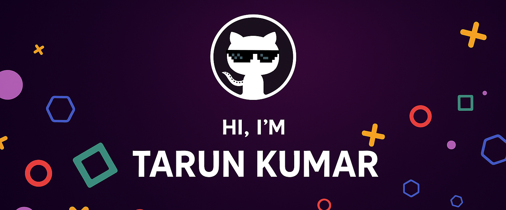

<!--Banner-->

<!--Contact Section--> 

 
  
  
 

<!--Night Owl image

  

-->

<!--Header Name-->
#  ɪ'ᴍ Tarun!
*Second-year student pursuing Bachelrs in IoT at Dayalbagh Educational Institute🎓. I'm a passionate learner who's always willing to learn and work across technologies and domains. I love discovering new technologies and experimenting with tools that solve real-world problems💡. I'm Currently focused on web development, and gradually exploring the world of DevOps and Cloud Computing ☁️*

- 🔗 Currently working on an **AI platform** focused on **PDF analysis and content generation**.
- 🌱 I’m constantly learning — I believe every day is a chance to improve and explore new technologies.
- 💬 Ask me about **Node.js, React, Firebase...** or anything [here](https://github.com/tarunkumar-sys/tarunkumar-sys/issues).
- 🧠 Passionate about building scalable, maintainable systems with clean code practices.
- 🎧 When not coding, I’m into tech podcasts, AI news, and the latest in developer tools.
- 💻 Visit my [**Portfolio**](https://my-portfolio-zeta-ruddy-57.vercel.app/) for more about me.

<!--Profile Count Badge-->

  

<!--Github stats Table--> 
<h2 align="center">⚒️ Tᴇᴄʜɴᴏʟᴏɢʏ Sᴛᴀᴄᴋ ⚒️</h2>
 

    
     

 

<!--Github stats Table--> 
<h2 align="center">📊 Mʏ Gɪᴛʜᴜʙ Sᴛᴀᴛs 📊</h2>

<table width="100%">
  <tr>
    <td width="50%">
      <h3 align="center"><strong>Gɪᴛʜᴜʙ Sᴛᴀᴛs</strong></h3>
      

        
      

    </td>
    <td width="50%">
      <h3 align="center"><strong>Sᴛʀᴇᴀᴋ Sᴛᴀᴛs</strong></h3>
      

        
      

    </td>
  </tr>
  <tr>
    <td width="50%">
      <h3 align="center"><strong>Lᴀᴛᴇsᴛ Pʀᴏᴊᴇᴄᴛ</strong></h3>
      

        
      

    </td>
    <td width="50%">
      <h3 align="center"><strong>Tᴏᴘ Cᴏɴᴛʀɪʙᴜᴛɪᴏɴs</strong></h3>
      

        
      

    </td>
  </tr>
</table>
 

<!--Contribution Graph-->
<h2 align="center">📈 Cᴏɴᴛʀɪʙᴜᴛɪᴏɴ Gʀᴀᴘʜ 📈</h2>

    

 

<!--LeetCode status-->
<h2 align="center">⚡ LᴇᴇᴛCᴏᴅᴇ Sᴛᴀᴛs ⚡</h2>

  

<!--Footer--> 

  

